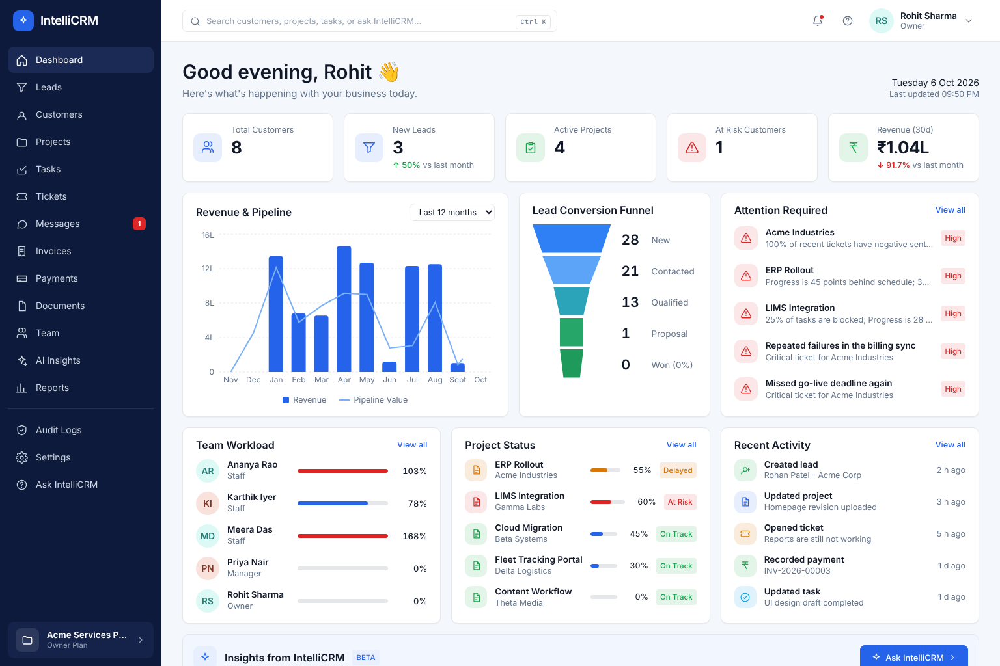
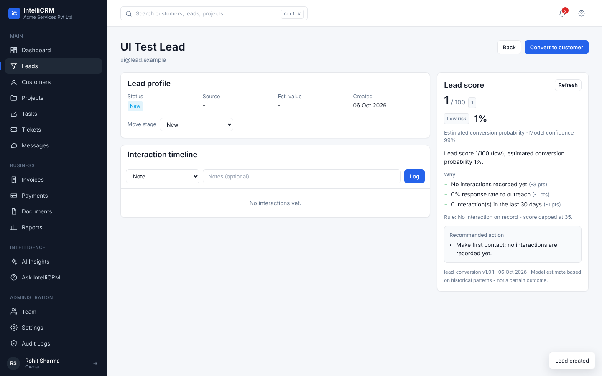
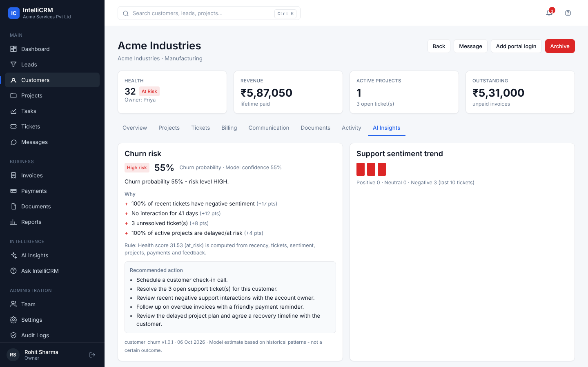
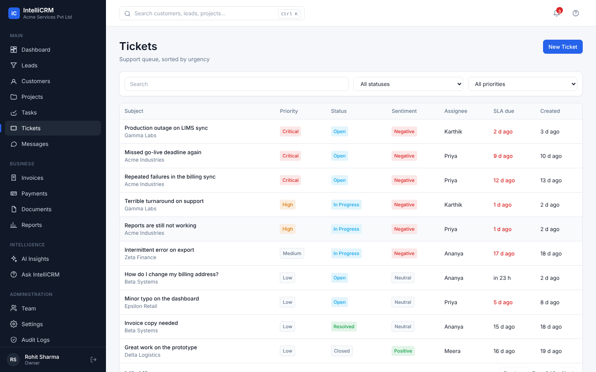
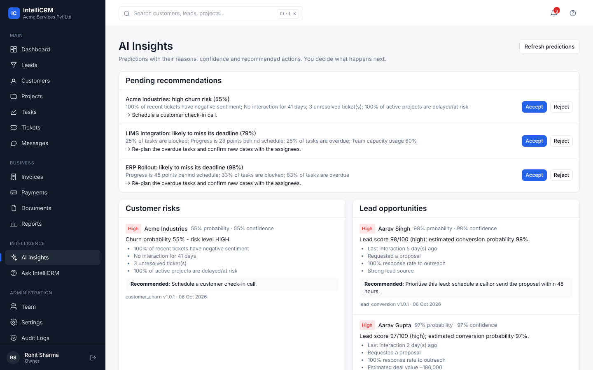
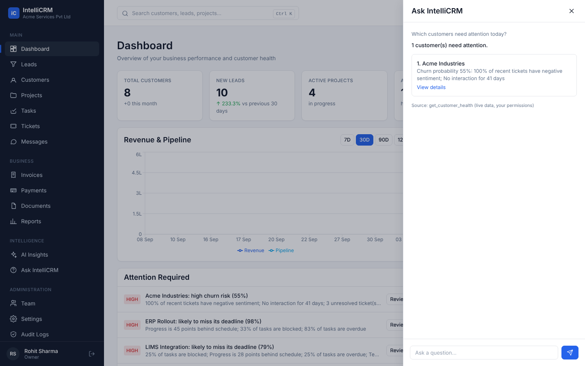
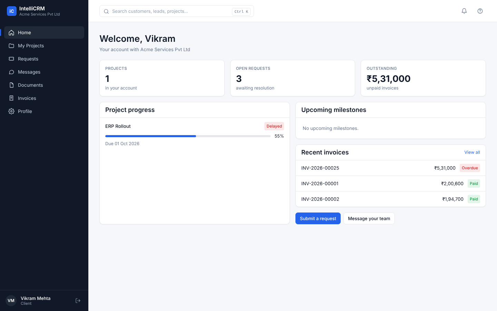

# IntelliCRM - User Guide, Feature Reference and How It Works

IntelliCRM is a multi-role CRM for service businesses. It joins **leads, customers, projects, tasks, support tickets,
messaging, invoicing/payments, documents, reports** and **explainable AI** in one application, with a separate
**client portal** for your customers.

This guide has three parts:

1. [How to use it](#part-1---how-to-use-it) - sign-in, roles, every screen, common workflows
2. [Feature reference](#part-2---feature-reference) - what is built, including the AI features and their limits
3. [How it works](#part-3---how-it-works) - architecture, security model, data, AI pipeline, operations

> Everything in this guide was verified against the running system. Things that are **not** built are listed
> honestly in [Known limitations](#known-limitations-and-deviations-from-the-spec).

---

# Part 1 - How to use it

## 1.1 Getting in

1. Open `http://localhost:3000`. You land on the sign-in page.
2. **Existing user:** enter email and password. **New business:** click *"New organization? Create an account"* - this creates your
   organization and makes you its **Owner**.
3. On the sign-in page, **demo-account buttons (Owner, Manager, Staff, Client) sign you in with one click** once the demo data is loaded.
   Demo data (optional, `python -m app.seed.demo`) gives you a ready-made company "Acme Services". Password for every demo user is `Demo@12345`:

| You are | Sign in as | What you see |
| --- | --- | --- |
| Owner | `owner@acme-demo.example` | everything |
| Manager | `manager@acme-demo.example` | leads, assigned customers/projects/tickets, team workload, reports |
| Staff | `staff.meera@acme-demo.example` (also `.ananya`, `.karthik`) | only work assigned to you |
| Client | `client@acme-industries.example` | the client portal for Acme Industries |

Sessions: a short-lived access token (15 min) is renewed silently using a secure httpOnly cookie. *Log out* (bottom-left) revokes it.
Too many failed sign-ins (10 in 5 minutes for the same address) are temporarily blocked.

## 1.2 Layout



* **Dark left sidebar** - navigation, grouped *Main / Business / Intelligence / Administration*. Items you have no permission for are hidden. Your name, role and the log-out button are at the bottom. On phones the sidebar becomes a drawer (☰).
* **Top bar** - global search (press **Ctrl/Cmd + K**), notification bell with unread count, help.
* Every list page has the same pattern: **search + filters → sortable table → pagination (25 per page)**, with loading skeletons, empty states with a call-to-action, and error states with *Retry*.

## 1.3 Who can do what

| Capability | Owner | Manager | Staff | Client |
| --- | :-: | :-: | :-: | :-: |
| Dashboard | ✔ all data | ✔ assigned scope | ✔ assigned scope (reduced) | portal home instead |
| Leads (view/create/convert) | ✔ | ✔ (organization-wide) | ✘ | ✘ |
| Customers | ✔ all | ✔ assigned | ✔ assigned | ✔ own account only |
| Projects / tasks | ✔ all | ✔ assigned + assign tasks | ✔ own tasks, update status/hours | own projects (read) |
| Tickets | ✔ all | ✔ assigned scope | ✔ assigned | ✔ own requests |
| Internal notes on tickets | ✔ | ✔ | ✔ | **never visible** |
| Invoices | ✔ create/issue/cancel | view (assigned customers) | ✘ | own invoices (no drafts) |
| Record payments | ✔ | ✘ | ✘ | ✘ |
| Reports | ✔ all | ✔ (within assigned scope) | ✘ | ✘ |
| AI insights, Ask IntelliCRM | ✔ | ✔ | ✔ (own scope) | Ask: project/status only |
| Team, roles, workload | ✔ manage | view | ✘ | ✘ |
| Audit logs, org settings | ✔ | ✘ | ✘ | ✘ |

"Assigned scope" means: customers you own or that have a project/ticket/task assigned to you, and the projects/tickets/tasks attached to them.
The exact rules are in `backend/app/core/scope.py`, and are enforced **on the server for every request**.

## 1.4 Screen-by-screen

### Dashboard
Answers *what is happening, what is going wrong, what should I do?*
* **Greeting + KPI row:** time-aware greeting, then Total Customers, New Leads, Active Projects, At-Risk Customers, Revenue (30 days), each with an icon and trend vs the previous period.
* **Revenue & Pipeline:** monthly revenue bars with the open-lead pipeline as a line; pick last 12 months / 90 / 30 / 7 days; hover for a tooltip.
* **Lead Conversion Funnel:** New → Contacted → Qualified → Proposal → Won, with counts and % of the top of the funnel.
* **Attention Required:** AI recommendations (churn, project delay), critical tickets and overdue payments. *Review* opens the entity.
* **Project Status**, **Team Workload** (tasks and capacity per person, ⚠ when overloaded), **Recent Activity**, and the **Insights from IntelliCRM** strip.

### Leads and Lead 360
* **Add Lead**, **Import** (CSV), **Export** (CSV). Filters: search, status, source, owner, score, date range. Click a column header to sort.
* Lead stages: *New → Contacted → Qualified → Proposal → Negotiation → Won / Lost*.
* **Lead 360** shows the profile, interaction timeline (log calls, emails, replies, inquiries, pricing-page visits, proposal requests) and the **AI score panel**:



  A lead score is **never shown without its explanation**: 0-100 score, conversion probability, model confidence, the top reasons (± points), any business rule that adjusted it, the recommended next action, and the model name/version.
* **Convert to customer** is one atomic action: it creates (or links) a customer, marks the lead *Won*, and keeps the lead and all its interactions as history. A lead can only be converted once.
* **CSV import** is two-step: *Validate* shows row-level errors and a preview; nothing is saved until you press *Confirm import*. Required column: `name`. Optional: `company_name, email, phone, source, status, estimated_value`.

### Customers and Customer 360
* Table: customer, company, **health** (Healthy / Watch / At Risk / Critical + score), projects, open tickets, last interaction, revenue, owner.
* **Customer 360** tabs: *Overview* (contacts, details, notes) · *Projects* · *Tickets* · *Billing* · *Communication* · *Documents* · *Activity* · *AI Insights*.



* The **AI Insights** tab shows churn probability, risk level, the reasons, recommended actions and the support-sentiment trend of the last 10 tickets.
* **Health score** (0-100) is a transparent formula, not a black box: it starts at 100 and subtracts for interaction recency, open tickets, negative sentiment, delayed projects, overdue invoices and low feedback.
* Owners can **Add portal login** to give a customer contact access to the client portal.

### Projects and Project Detail
* Table: project, customer, manager, progress bar, status, due date, **AI risk**, budget. Statuses: *Planning, Active, At Risk, Delayed, Completed, Archived*.
* Detail tabs: *Overview · Tasks · Milestones · Team · Files · AI Risk*. The **AI Risk** tab shows delay probability and why (overdue/blocked tasks, schedule gap, team capacity, milestone completion) with recommended actions and a *Recalculate* button.
* **Progress is calculated automatically** from tasks (done ÷ non-cancelled). The AI never changes a project's status - a manager does.

### Tasks
* Priority-ordered list (Critical → Low, then due date). Filter by status, priority, "assigned to me". Change status inline.
* Staff can update status/hours on their own tasks; only managers/owners can reassign, re-prioritise or change due dates.
* **Dependencies:** a task cannot move to *In Progress / Review / Done* while a task it depends on is unfinished; circular dependencies are rejected.
* **Workload:** capacity = estimated remaining hours of open tasks ÷ (weekly capacity × 2 weeks). *Normal < 80% · High 80-100% · Overloaded > 100%*.

### Tickets and Ticket Detail



* Sorted by urgency. New tickets are analysed automatically: **sentiment** (Positive/Neutral/Negative + confidence), **suggested priority** (+ confidence), **category**, and an **SLA due time** (Critical 4 h · High 8 h · Medium 24 h · Low 72 h).
* **Humans always have the last word:** change the priority/assignee/status in the side panel. The original AI prediction is kept next to your override.
* Reply to the customer, or tick **Internal note** - internal notes are highlighted and are *never* visible to clients.
* **Summarise & suggest reply** produces a *draft* summary and reply. Press *Accept & edit* to copy it into the reply box, or *Reject*. It is never sent automatically.
* **Escalate** raises priority one level, resets the SLA and notifies owners/managers.

### Messages
* Two kinds of conversations: **Client** (customer-facing, linked to a customer) and **Internal** (employees only - clients can never be added).
* Real-time over WebSocket: new messages appear without refreshing; typing indicator; unread badges; "Sent/Read" status; per-conversation message search.
* You only ever see conversations you are a member of.

### Invoices and Payments
* **New Invoice:** pick customer, due date, optional discount and line items (description, quantity, unit price, tax %). The form shows an *estimate*; **the server recalculates every amount** and any totals sent by the browser are ignored.
* Lifecycle: *Draft → (Issue) Sent → Partially Paid → Paid*, plus *Overdue* (automatic when past due) and *Cancelled* (only if nothing was paid).
* **Record payment** (Owner): amount, method, processor reference. Overpayment is rejected; concurrent payments are serialised so an invoice can never be paid twice. Never enter card numbers - only a reference.
* **Download PDF** from the invoice page. Summary cards: Outstanding, Overdue, Paid this month, Revenue. *Payments* lists every payment.

### Documents
* Upload files (PDF, images, Word/Excel/PowerPoint, CSV, TXT, ZIP; max 10 MB) against a customer. Files are stored outside the database under random keys; the browser never sees storage paths. Download and delete are permission-checked per request.

### Team (Owner/Manager)
* People with role, active/overdue tasks, **capacity bar** and workload status. Owners can add members, change roles and suspend/activate users (the last active owner cannot be demoted).
* This is capacity planning from task data only - no activity monitoring.

### Reports
* Sales (*lead funnel, conversion by source*), Customers (*health, churn risk*), Projects, Support (*created/resolved, avg resolution hours, SLA breaches*), Revenue (*monthly, overdue invoices*), Team workload, and **AI model quality**. Date range + **Export CSV**. Every report respects your role and organization.

### AI Insights



* **Pending recommendations** - Accept or Reject each one (recorded with who/when). Nothing is executed automatically.
* Sections: customer risks, lead opportunities, project delays, ticket risks, revenue anomalies (overdue receivables), workload warnings. Every insight shows the prediction, probability/confidence, the main factors, a recommended action and **model version + timestamp**.
* **Refresh predictions** (Owner/Manager) queues a background recalculation.

### Ask IntelliCRM (sidebar → right-hand drawer)



Ask in plain language, e.g. *"Which customers need attention today?"*, *"Which projects are likely to be delayed?"*, *"What should I work on next?"*, *"Which invoices are overdue?"*, *"Who is overloaded?"*, *"Show me the lead pipeline"*, *"What tickets are open?"*, *"What is the status of my projects?"*.
The assistant only answers from data **you** are allowed to see; if your role cannot access a topic it says so. Unknown questions get role-appropriate suggestions.

### Client portal



Clients see their own world only - **Home** (project progress, upcoming milestones, open requests, outstanding balance, recent invoices), **My Projects**, **Requests** (tickets), **Messages**, **Documents**, **Invoices**, **Profile**. No internal terminology, notes, lead scores, workload or AI risk data. A client's request has its priority/category set by the system, not by the client.

### Notifications, search, settings, audit
* **Bell** - assignments, ticket assignment/escalation, new messages, payments, invoices, customer/project risk. Choose which types you want in *Settings → Notification preferences*.
* **Global search** (Ctrl/Cmd+K) - leads, customers, projects, tasks, tickets, invoices and your messages, using PostgreSQL full-text prefix search; results are limited to what you may see.
* **Settings** - profile, change password (signs out other sessions), notification preferences, organization details (Owner).
* **Audit Logs** (Owner) - filter by action/entity/date; click a row to see before/after data, IP and user agent. Covers sign-in/out, permission changes, customer/lead/project/task/ticket changes, lead conversion, invoices, payments, document actions, exports/imports, AI runs, recommendation decisions and assistant queries.

## 1.5 A typical end-to-end story

1. A **lead** arrives (or is imported). Log interactions → the **score** rises with proposal requests, replies and pricing-page visits.
2. The owner sees a high-scoring lead, sends a proposal, and **converts** it → a **customer** exists, history retained.
3. A manager creates a **project** for the customer, adds **milestones**, and assigns **tasks** (workload bars show who has capacity).
4. The customer submits a **request** in the portal → a **ticket** is created, sentiment/priority are predicted, the account owner is notified.
5. Staff reply (public) and discuss (internal note). Work slips: overdue and blocked tasks push the **delay probability** up.
6. The **dashboard** shows *"ERP Rollout is likely to miss its deadline (98%)"* with reasons. The owner opens it, accepts the recommendation, rebalances tasks.
7. The owner **invoices** the milestone, **issues** it (the client sees it in the portal) and **records the payment**. Customer revenue and health update.
8. Everything above is in the **audit log**.

---

# Part 2 - Feature reference

| Area | Implemented |
| --- | --- |
| Authentication | email/password (Argon2id), 15-min access token, rotating refresh token (httpOnly cookie, hashed server-side), logout/revocation, sign-in rate limit, change password (revokes sessions), self-service organization registration |
| Multi-tenancy | every business row carries `organization_id`; resolved server-side from the session; cross-organization access returns *404* |
| RBAC | 4 system roles × 27 permissions in the database + object-level scope rules |
| Leads | CRUD, soft delete, owner, interactions, ML score + explanation, atomic conversion, CSV import (validate/confirm) and export, filters/sort/pagination |
| Customers | CRUD, contacts, health score, churn prediction, sentiment trend, portal logins, CSV import/export, 360 view |
| Projects | CRUD, members, milestones, auto progress, delay prediction, risk panel |
| Tasks | CRUD, assignment rules, dependencies (cycle-safe, enforced), statuses/priorities, hours, overdue tracking |
| Workload | capacity % per person (2-week window) with Normal/High/Overloaded |
| Tickets | CRUD, SLA, comments with internal notes, sentiment + priority + category AI, human override, escalation, reply drafts/summary |
| Messaging | client/internal conversations, membership authorization, WebSocket push, typing, unread/read, search |
| Billing | server-side totals (Decimal), draft/issue/cancel, payments with row locking, overdue detection, PDF, summaries |
| Documents | upload/download/soft-delete, type + size validation, generated storage keys, per-request authorization |
| Reports | 10 reports, date range, CSV export |
| AI | 5 CPU models, explanations, recommendations lifecycle, insights page, assistant with permission-checked tools |
| Notifications | in-app, per-type preferences, bell + page, real-time refresh |
| Search | PostgreSQL full-text (GIN indexes), permission-scoped |
| Audit | append-style log with before/after, IP, user agent |
| Operations | Alembic migrations, seed data, background worker, Docker files |

### The AI models (all CPU, scikit-learn)

| Model | Algorithm | Predicts | Test metrics* |
| --- | --- | --- | --- |
| `lead_conversion` | Logistic Regression (standardised) | conversion probability → score 0-100 | acc 0.69 · F1 0.67 · ROC-AUC 0.78 |
| `customer_churn` | Random Forest | churn probability, risk level | acc 0.75 · precision 0.65 · recall 0.46 · ROC-AUC 0.80 |
| `project_delay` | Gradient Boosting | delay probability, risk level | acc 0.77 · F1 0.80 · ROC-AUC 0.84 |
| `ticket_sentiment` | TF-IDF + Logistic Regression | Positive / Neutral / Negative | acc 0.93 · macro-F1 0.93 |
| `ticket_priority` | TF-IDF + Logistic Regression | Low / Medium / High / Critical | acc 0.96 · macro-F1 0.95 |

\* **Important:** these models are trained on *synthetic* demo data (Stage A in `PROJECT.md`), so the numbers show that the pipeline works - they say
nothing about accuracy on your real customers. Retrain on your own anonymised history before relying on the output (see §3.7). Every metric,
the feature list, the version and the training date are stored next to the model and shown at `GET /ai/models` and in *Reports → AI model quality*.

Risk levels: probability **< 30% low · 30-50% medium · ≥ 50% high**; lead score **≥ 80 high · 50-79 medium · < 50 low**; health score **≥ 70 healthy · 50-69 watch · 30-49 at risk · < 30 critical**.

### Known limitations and deviations from the spec

Honest list of what is **not** built or differs, so nothing is mistaken for finished:

* **Training data is synthetic only.** No public/real dataset is bundled. XGBoost is not used (scikit-learn's Random Forest / Gradient Boosting cover the same role with no extra dependency).
* **LLM:** not integrated. "Ask IntelliCRM" routes questions to fixed, permission-checked tools and formats the answer with templates. `LLM_API_KEY` is reserved for a future natural-language layer; the tools were designed so an LLM can sit on top without gaining SQL access.
* **Email:** nothing is sent by email (no SMTP integration). Notifications are in-app. **Password reset and email verification are not implemented** (the `email_verified_at` column exists; users can change their own password in Settings, but there is no "forgot password" flow yet).
* **Not built because the schema in `DATABASE.md` has no table for it:** task comments, task attachments, task checklists, message attachments, @mentions, ticket attachments in the UI (the API accepts documents on tickets), document versioning (the `version` column exists), document preview.
* **Files:** local directory storage only; S3-compatible storage is not implemented. Downloads are authorised by the API on every request instead of using time-limited signed URLs.
* **Real-time** uses an in-process WebSocket hub - correct for one backend instance; multiple instances need a Redis pub/sub bridge. Redis is currently used only for the sign-in rate limiter and the worker lock; the worker is a simple scheduler loop, not a Redis job queue.
* **UI gaps:** Project detail has no Communication/Activity tabs; Customer 360 *Activity* shows audited customer actions only; no UI to switch organization (API supports `organization_slug` at login); no PDF report export (CSV only); Team page has no performance/availability metrics beyond workload.
* **Roles:** only the four system roles (no custom per-organization roles yet). Client "approve / request changes" is not implemented.
* **Invoice "send"** marks the invoice *Sent* and notifies portal users in-app; no email delivery. The PDF is a plain functional layout.
* **Docker:** `docker-compose.yml` and Dockerfiles are provided but were **not run** (no Docker daemon in the build environment). Native setup is what was exercised.
* **Not load-tested.** Indexes follow `DATABASE.md`; there has been no performance tuning. Accessibility basics (labels, focus, ARIA, keyboard, non-colour cues) are in place but there has been no formal audit.

---

# Part 3 - How it works

## 3.1 Architecture

```
 Browser (Next.js / React / TypeScript)
   │  same-origin /api/*  (Next rewrites → FastAPI)          ws://…:8000/api/v1/ws (real-time)
   ▼
 FastAPI  /api/v1  ── auth → membership → role/permissions → object scope → service → response
   │                         │
   ├── PostgreSQL 16  (single source of truth, 30 tables, 4 Alembic migrations)
   ├── File storage   (local dir in dev; metadata in PostgreSQL)
   ├── CPU ML         (scikit-learn artifacts in ml/artifacts, versioned)
   └── Redis (optional: rate limit, worker lock)
 Background worker (python -m app.workers.scheduler): refreshes predictions/health, flags overdue invoices
```

It is a **modular monolith**: one deployable backend with packages `core, models, api, services, ai, seed, workers`.

## 3.2 A request, step by step

1. The browser calls e.g. `GET /api/v1/customers?health=at_risk` with `Authorization: Bearer <access token>`.
2. `get_ctx` decodes the JWT, then **re-reads the database**: user active? member of that organization? which role → which permissions. (Role changes and suspensions therefore take effect immediately, not at token expiry.)
3. `require("customers.read")` checks the permission; otherwise **403**.
4. The query is built with `organization_id = <from the session>` **and** the object-level condition from `scope.py` (owner = all; manager/staff = assigned; client = own account). An object outside your scope returns **404**, not 403, so existence is not leaked.
5. The response is serialised; internal-only fields (health score, AI risk, sentiment, notes, internal comments) are removed for clients.
6. The session commits once at the end - or rolls back entirely on any error.
7. Errors always use one shape: `{"error": {"code": "RESOURCE_NOT_FOUND", "message": "...", "request_id": "..."}}`; stack traces are never returned, and every response carries an `X-Request-ID`.

Nothing in the browser is trusted: route hiding is only cosmetic, the `organization_id` is never accepted from the client, and totals are never accepted from the client.

## 3.3 Data model (PostgreSQL)

30 tables, UUID primary keys, `TIMESTAMPTZ` (UTC), lowercase snake_case plural names, all schema changes through Alembic (`alembic upgrade head` / `downgrade`). Groups:

* **Identity & access:** `organizations, users, roles, permissions, role_permissions, organization_members, refresh_tokens`
* **CRM:** `leads, lead_interactions, customers, customer_contacts`
* **Delivery:** `projects, project_members, milestones, tasks, task_dependencies`
* **Support & comms:** `tickets, ticket_comments, conversations, conversation_members, messages`
* **Money & files:** `invoices, invoice_items, payments, documents, feedback`
* **Intelligence & platform:** `ai_predictions, ai_recommendations, notifications, audit_logs`

Integrity is enforced **by the database**, not only the app: foreign keys (`ON DELETE RESTRICT` for business entities), unique keys (e.g. `(organization_id, invoice_number)`), `CHECK` constraints (scores 0-100, probabilities 0-1, non-negative money, `amount_paid <= total`, valid status lists, no self-dependency), and indexes on organization/status/dates/owners plus GIN full-text indexes. Important records use soft delete (`deleted_at`). Money is `NUMERIC(14,2)` end to end (Python `Decimal`, returned to the browser as strings).
Additions beyond `DATABASE.md` (all additive): table `refresh_tokens` (revocable sessions); columns `users.preferences`, `users.weekly_capacity_hours`, `customer_contacts.user_id` (links a portal login to a customer), `invoice_items.position` (stable line order), `customers.source_lead_id`, `conversations.title`.

## 3.4 Security model

* **Passwords:** Argon2id. **Tokens:** HS256 JWT access token (15 min, held in memory only) + opaque random refresh token stored as a salted SHA-256 hash, rotated on every use, revocable.
* **Tenant isolation:** organization from the authenticated membership; every query filters on it; cross-organization IDs referenced in a request (e.g. a customer from another company) are rejected.
* **Authorization layers:** authenticated → active member → role permission → object scope → field-level redaction for clients.
* **Input:** Pydantic validation on every body/query (types, lengths, ranges, enums); SQLAlchemy parameterised queries; CSV cells that look like formulas are neutralised on export; uploads are type- and size-limited and stored under generated keys.
* **Money:** server computes line totals, tax, discount and balance; payment recording locks the invoice row (`SELECT … FOR UPDATE`) in a single transaction; cards/CVV are never accepted.
* **Assistant:** no free-form SQL; a fixed set of tools, each applying the caller's own permissions and scope; every query is audited.
* **Operational:** CORS allow-list, request IDs, no sensitive values in logs, secrets only from environment variables.

## 3.5 Business rules worth knowing

* Lead conversion, invoice creation and payment recording run in single transactions (all-or-nothing).
* Task progress → project progress is automatic; AI never edits statuses, priorities or assignments - it only creates *pending recommendations* (and notifications) that a person accepts or rejects.
* Ticket SLA = creation time + priority-based hours; a manual priority change re-baselines the SLA.
* A sent/partially-paid invoice past its due date becomes *Overdue* (on read, and by the worker).
* A customer's `revenue` increases only when a payment is recorded.
* Clients can only create tickets/conversations for their own account; they cannot choose conversation members.

## 3.6 Background work and real-time

* `python -m app.workers.scheduler` loops (default hourly; `WORKER_INTERVAL_MINUTES`) over active organizations: recalculates lead scores, customer health + churn, project delay, creates recommendations/notifications for new high risks, and marks overdue invoices. `--once` runs a single pass. With `REDIS_URL` set, a short lock stops two workers overlapping.
* *Refresh predictions* in the UI queues the same job in the background so the request returns immediately.
* The browser opens one WebSocket (`/api/v1/ws?token=…`, token validated, membership re-checked) for message pushes, notification refresh and typing events.

## 3.7 The AI pipeline

```
PostgreSQL rows → feature extraction (service.py) → CPU model (joblib) → probability
   → explanation (factors, rules) → ai_predictions row (model name/version/confidence/JSON explanation)
   → ai_recommendations (pending) → human Accept / Reject → audit log
```

* **Features** are computed live from your data, e.g. lead: interactions in 30 days, days since last contact, inquiries, proposal requested, pricing-page visits, reply rate, source quality, company present, deal value. Churn: recency, tickets in 90 days, open tickets, negative-sentiment ratio, delayed-project ratio, overdue-invoice ratio, activity, feedback. Project delay: progress vs elapsed time, overdue/blocked task ratios, milestone completion, days remaining, team capacity.
* **Explanations** are local: each feature is replaced by a healthy/reference value and the change in probability is reported ("+9 pts: no interaction for 41 days"). For text models the top contributing terms are shown. Business rules that adjust a result (e.g. *lost lead capped at 5*) are listed separately.
* **Confidence** is the model's certainty in its predicted class (max class probability) - not a guarantee of correctness. Every prediction states that it is an estimate.
* **History is kept:** a new row is written only when the value changes (≥ 1 point) or the model version changes, so you can see how a risk evolved.
* **Model lifecycle:** artifacts live in `ml/artifacts/<name>.joblib` with `<name>.json` (algorithm, version, features, training date, metrics, baseline). If an artifact for the current version is missing it is trained automatically on first use. To retrain: `cd backend && python -m app.ai.training`. To use real data, replace the generators in `app/ai/synthetic.py` with extraction from your anonymised history and bump `VERSION` in `app/ai/training.py` - new predictions then carry the new version.

## 3.8 Running, configuring and operating it

| Task | Command |
| --- | --- |
| Create / upgrade schema | `cd backend && alembic upgrade head` |
| Roll back one migration | `alembic downgrade -1` |
| Check models match migrations | `alembic check` |
| Seed demo data (dev only) | `python -m app.seed.demo` (`--reset` recreates it) |
| Run API | `uvicorn app.main:app --port 8000` (OpenAPI UI at `/api/docs`) |
| Run worker | `python -m app.workers.scheduler` |
| Run web | `cd frontend && npm run dev` / `npm run build && npm start` |
| Retrain models | `python -m app.ai.training` |
| Backend tests | `cd backend && pytest` |
| Frontend tests / types | `cd frontend && npm test && npm run lint` |

Configuration (environment variables): `DATABASE_URL`, `REDIS_URL`, `JWT_SECRET`, `JWT_REFRESH_SECRET`, `STORAGE_DIR`, `MODEL_DIR`, `CORS_ORIGINS`, `ACCESS_TTL_MINUTES`, `REFRESH_TTL_DAYS`, `MAX_UPLOAD_BYTES`, `LLM_API_KEY`.
**Before production:** set strong random `JWT_*` secrets (the built-in development defaults are public), serve over HTTPS (so the refresh cookie can be marked `Secure`), put real backups in place (`pg_dump`/point-in-time recovery - never commit dumps), and use managed Postgres/Redis and object storage.
The demo seed is a separate command and is never run automatically.

## 3.9 API quick reference (`/api/v1`, 72 paths)

| Group | Endpoints (selection) |
| --- | --- |
| Auth | `POST /auth/register · login · refresh · logout`, `GET /auth/me`, `PATCH /me`, `POST /me/password` |
| Dashboard / search | `GET /dashboard?range=7D|30D|90D|12M`, `GET /search?q=` |
| Leads | `GET/POST /leads`, `GET/PATCH/DELETE /leads/{id}`, `POST /leads/{id}/interactions · score · convert`, `POST /leads/import?confirm=`, `GET /leads/export` |
| Customers | `GET/POST /customers`, `GET/PATCH/DELETE /customers/{id}`, `POST …/contacts · portal-users`, `GET …/activity`, import/export |
| Projects | `GET/POST /projects`, `GET/PATCH/DELETE /projects/{id}`, `POST …/milestones · members · risk` |
| Tasks | `GET/POST /tasks`, `GET/PATCH/DELETE /tasks/{id}`, `POST/DELETE …/dependencies` |
| Team | `GET /team`, `GET /team/directory`, `POST /team/members`, `PATCH /team/members/{id}` |
| Tickets | `GET/POST /tickets`, `GET/PATCH /tickets/{id}`, `POST …/comments · escalate`, `GET …/assist` |
| Messaging | `GET/POST /conversations`, `GET/POST /conversations/{id}/messages`, `WS /ws` |
| Billing | `GET/POST /invoices`, `GET/PATCH /invoices/{id}`, `POST …/issue · cancel · payments`, `GET …/pdf`, `GET /invoices/summary`, `GET /payments` |
| Documents | `GET/POST /documents`, `GET /documents/{id}/download`, `DELETE /documents/{id}` |
| Reports | `GET /reports/{name}?date_from&date_to&format=csv` |
| AI | `GET /ai/insights · recommendations · models · predictions/{type}/{id}`, `POST /ai/recommendations/{id}/decision · run · assistant/query` |
| Misc | `GET/POST /notifications…`, `GET /audit-logs`, `GET/PATCH /settings/organization`, `GET /portal/home` |

List endpoints take `page` (default 1) and `page_size` (default 25, max 100) and return `{items, page, page_size, total}`.

## 3.10 Quality assurance

* **Backend - 79 automated tests** (pytest, real PostgreSQL): authentication and token rotation, rate limiting, **cross-organization isolation**, role permissions, staff/client scoping, **clients cannot read internal comments or AI fields**, last-owner protection, lead conversion atomicity, CSV validation and formula-injection protection, task dependency/cycle rules, invoice maths and DB constraints, payment lifecycle and **concurrent-payment safety**, document access, AI explainability and recommendation lifecycle, assistant RBAC and injection input, search (including index use), reports, audit trail.
* **Frontend - 11 unit tests** + strict TypeScript + production build; a **Playwright smoke test** (`frontend/scripts/e2e-smoke.mjs`) drives the real UI: sign-in, Ask IntelliCRM, search, form validation, lead creation → Lead 360 explanation, Customer 360 AI tab, recording a payment, and a phone-width layout check. It caught and led to the fix of a real dashboard bug during the build.

## 3.11 Troubleshooting

| Symptom | Cause / fix |
| --- | --- |
| Login page says *Incorrect email or password* | wrong credentials, suspended user, or no seed data - run `python -m app.seed.demo` |
| *Too many attempts* | sign-in limiter - wait 5 minutes |
| Pages show "Something went wrong" + a reference | note the `ref` (= `X-Request-ID`) and search the API log for it |
| No live messages | WebSocket is on port 8000 by default; set `NEXT_PUBLIC_WS_URL` when the API is elsewhere. Pages still work without it |
| AI sections empty | run *Refresh predictions* (or `python -m app.workers.scheduler --once`) after adding data |
| `relation … does not exist` | run `alembic upgrade head` |
| First AI call is slow | models are trained on first use if `ml/artifacts` is empty (a few seconds, once) |
